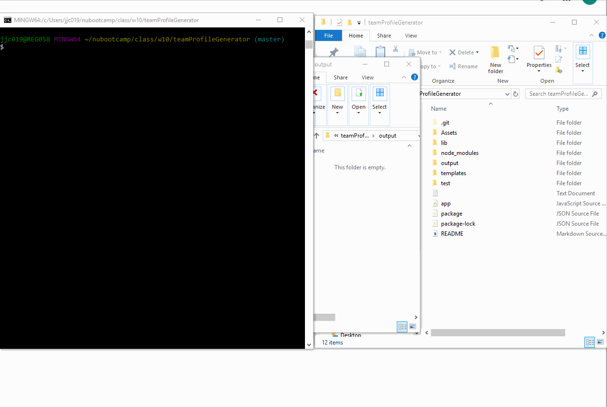

# Homework 10 - Team Profile Generator

The aim of this assignment is to create a command-line team generator application that dynamically generates an html team roster file based on user input. The application runs with the node app.js command. 

## User Story

```
As a manager
I want to generate a webpage that displays my team's basic info
so that I have quick access to emails and GitHub profiles
```

## Composition of Application

After executing the node command, the user is prompted for information on the team members they would like to add. Once the user decides they have finished adding all members, an HTML team roster file generates.

* Team Member Types:
  * Manager
  * Engineer
  * Intern
* Dependencies used:
  * jest
  * inquirer
  * fs 

## Process

I first created the desired template HTML and CSS layout with static data. I then updated the classes and constructors needed for each type of employee in individual js files, before updating the application code in app.js. All tests ran successfully.

console.log was useful for ensuring the written code ran correctly and produced the expected data responses. 

The dependencies for the application are listed in the package.JSON file and a gitignore file is used to to skip and prevent upload of the node_modules folder to GitHub.

## Deployment

The completed application is updated and available for download in Github: 
https://github.com/jenjch/teamProfileGenerator

A sample of a generated HTML is available in the output folder within the repo: (./output/team.html)

An animated gif demonstrating the app functionality is available in the repo and here: 

## Acceptance Criteria

I believe I have met all requirements for the application. Feedback on best practices and improvements would be appreciated.  
